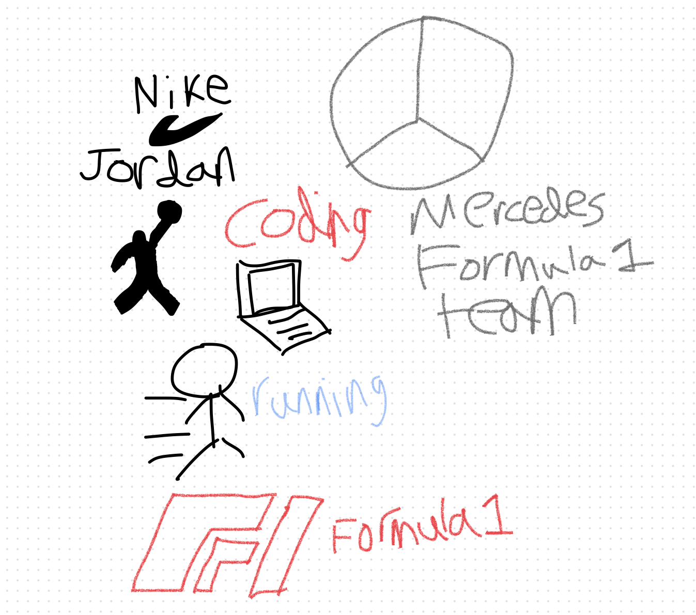

## Nitin Balaji's Page

Go to my [Github account](https://github.com/nitinsandiego) !!

## About Me
Hi! This is Nitin Balaji. I am 15 years old. I am an aspiring coder and my dream job is to work as a software engineer. 

## About Me Freeform Picture
My interests are coding, shoes, especially Jordans, Formula 1, and running.

## Overview of Hacks, Study and Tangibles
Blogging in GitHub pages is a way to learn and code at the same time. 

- Plans, Lists, [Scrum Boards](https://clickup.com/blog/scrum-board/) help you to track key events, show progress and record time.  Effort is a big part of your class grade.  Show plans and time spent!
- [Hacks(Todo)](https://levelup.gitconnected.com/six-ultimate-daily-hacks-for-every-programmer-60f5f10feae) enable you to stay in focus with key requirements of the class.  Each Hack will produce Tangibles.
- Tangibles or [Tangible Artifacts](https://en.wikipedia.org/wiki/Artifact_(software_development)) are things you accumulate as a learner and coder. 
