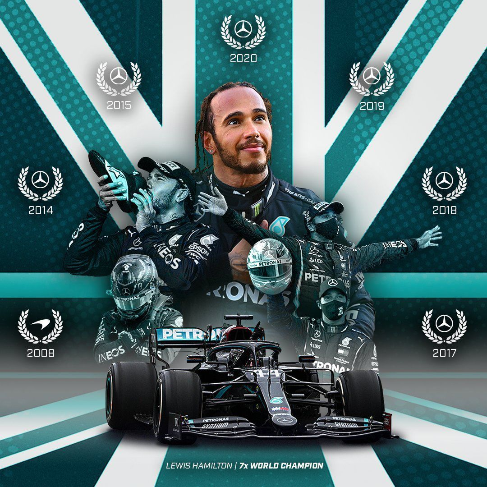
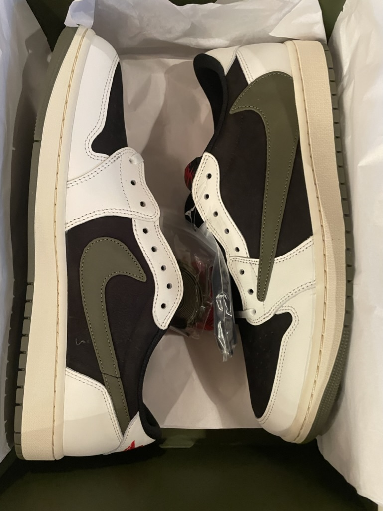

# Nitin Balaji's Page

Go to my [Github account](https://github.com/nitinsandiego) !!

## About Me
Hi! This is Nitin Balaji. I am 15 years old. I am an aspiring coder and my dream job is to work as a software engineer. A little about is I am a huge fan of Formula 1 and my favorite F1 Team is Mercedes AMG Petronas Formual 1 Team, and my favorite driver is Lewis Hamilton. Not only am I avid Formula 1 fan, I am also a fan of NFL and my favorite NFL team is the Denver Broncos. Also, I am a sneaker head and love collecting shoes. I am really excited to be taking AP Computer Science Principles and also excited to take future software courses.

### My Interests

### My Favorite Youtube Channels
[Carwow](https://www.youtube.com/@carwow)
<iframe width="560" height="315" src="https://www.youtube.com/embed/TptzkkbC1vE?si=gL68VWEy3_62xeXS" title="YouTube video player" frameborder="0" allow="accelerometer; autoplay; clipboard-write; encrypted-media; gyroscope; picture-in-picture; web-share" allowfullscreen></iframe>
<iframe width="560" height="315" src="https://www.youtube.com/embed/_FIVA-UhmZQ?si=ofKVulpE7yqUAo2j" title="YouTube video player" frameborder="0" allow="accelerometer; autoplay; clipboard-write; encrypted-media; gyroscope; picture-in-picture; web-share" allowfullscreen></iframe>

[ThrottleHouse](https://www.youtube.com/@ThrottleHouse)
<iframe width="560" height="315" src="https://www.youtube.com/embed/7xf35zoQcC4?si=aaTvi1d6a1b25pYA" title="YouTube video player" frameborder="0" allow="accelerometer; autoplay; clipboard-write; encrypted-media; gyroscope; picture-in-picture; web-share" allowfullscreen></iframe>

[Doug Demuro](https://www.youtube.com/@DougDeMuro)
<iframe width="560" height="315" src="https://www.youtube.com/embed/kcmWknKtJkk?si=-aUZ7a7rKEBX7aiB" title="YouTube video player" frameborder="0" allow="accelerometer; autoplay; clipboard-write; encrypted-media; gyroscope; picture-in-picture; web-share" allowfullscreen></iframe>

## About Me Freeform Picture
My interests are coding, shoes, especially Jordans, Formula 1, and running.

  <h2>Guess the Number Game</h2>
  
Try to guess the secret number between 1 and 100!

  <input type="number" id="user-input" placeholder="Enter your guess">
  <button id="submit-button">Submit Guess</button>
  

## Calculator

  <input type="text" id="calc-display" placeholder="0" readonly>
  

    <button onclick="appendNumber('7')">7</button>
    <button onclick="appendNumber('8')">8</button>
    <button onclick="appendNumber('9')">9</button>
    <button onclick="appendOperator('+')">+</button>
    <!-- Add more buttons for other numbers and operators -->
    <button onclick="calculate()">=</button>
    <button onclick="clearDisplay()">C</button>
  

## Overview of Hacks, Study and Tangibles
Blogging in GitHub pages is a way to learn and code at the same time. 

- Plans, Lists, [Scrum Boards](https://clickup.com/blog/scrum-board/) help you to track key events, show progress and record time.  Effort is a big part of your class grade.  Show plans and time spent!
- [Hacks(Todo)](https://levelup.gitconnected.com/six-ultimate-daily-hacks-for-every-programmer-60f5f10feae) enable you to stay in focus with key requirements of the class.  Each Hack will produce Tangibles.
- Tangibles or [Tangible Artifacts](https://en.wikipedia.org/wiki/Artifact_(software_development)) are things you accumulate as a learner and coder. 

**Contact Info**
- Email: nitinsandiego@gmail.com
- School Email: nitinb07892@stu.powayusd.com
- Phone: (858)-312-9834
- Discord: lewishamilton4463